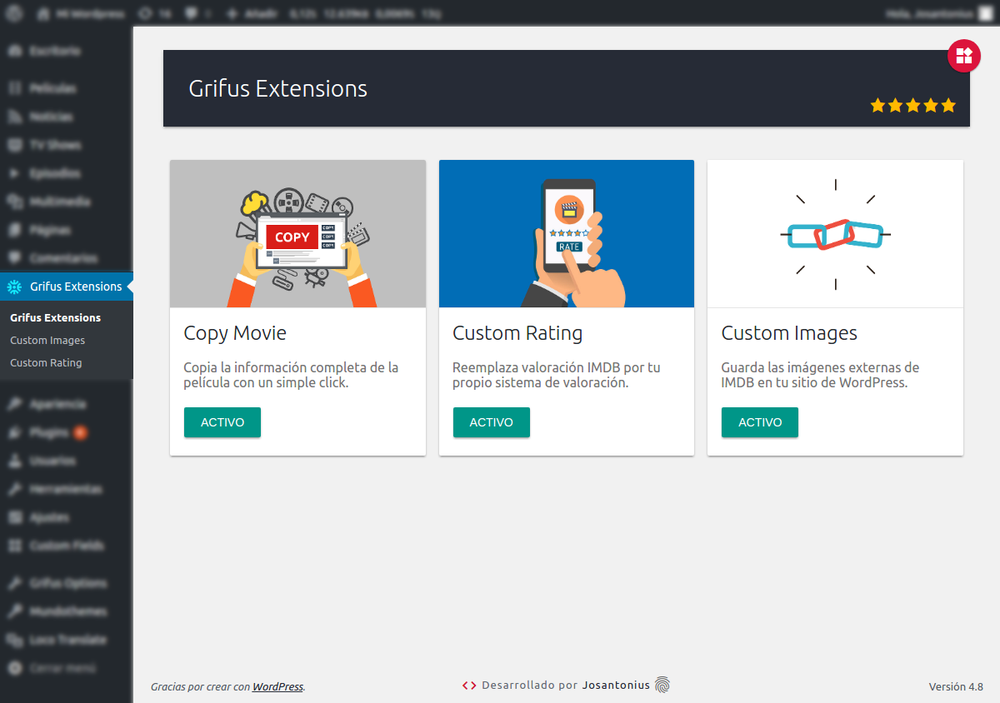
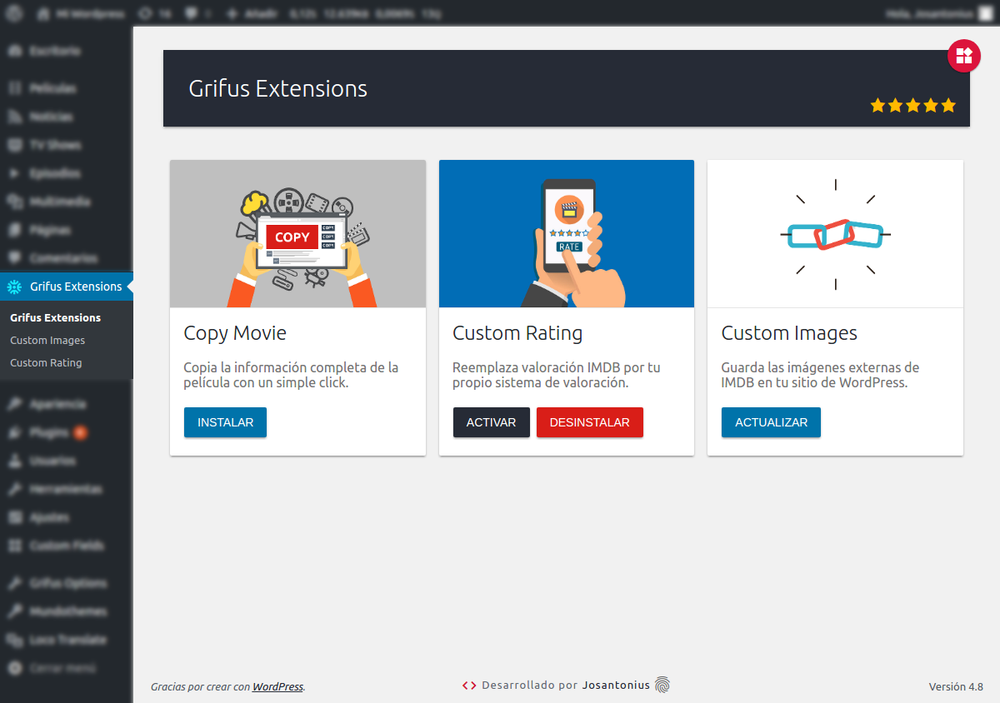

# Extensions For Grifus Wordpress Plugin

       

[English version](README.md)

Extensiones para el theme Grifus.

---

- [Requisitos](#requisitos)
- [Instalación](#instalación)
- [Imágenes](#imagenes)
- [Tests](#tests)
- [Tareas pendientes](#-tareas-pendientes)
- [Contribuir](#contribuir)
- [Licencia](#licencia)
- [Copyright](#copyright)

---

Este plugin contiene tres módulos:

[Copy Movie Grifus](https://github.com/eliasis-framework/copy-movie-grifus.git)
Añade un nuevo botón en las páginas de películas del theme Grifus con el que podrás copiar la información completa de la película con un solo click.

[Custom Images Grifus](https://github.com/eliasis-framework/custom-images-grifus.git)
Guarda imágenes externas de IMDB en tu sitio de WordPress. Reemplaza imágenes externas de IMDB y las guarda en tu sitio de WordPress.

[Custom Rating Grifus](https://github.com/eliasis-framework/custom-rating-grifus.git)
Reemplaza la clasificación IMDB en las películas del theme Grifus por tu propio sistema de clasificación. Sustituye el sistema de clasificación estática del theme Grifus por un sistema de clasificación dinámica.

  

## Requisitos

Este plugin es soportado por versiones de **PHP 5.6** o superiores y es compatible con versiones de **HHVM 3.0** o superiores.

Extensions For Grifus ha sido desarrollado bajo la versión 4.8 de WordPress y bajo la versión 4.0.3 del theme Grifus. 

## Instalación 

Puedes instalar este plugin desde el [repositorio oficial](https://es.wordpress.org/plugins/extensions-for-grifus/) en WordPress.

Utilizando [Composer](http://getcomposer.org/download/). En la carpeta raíz de WordPress ejecutar:

    $ composer require josantonius/extensions-for-grifus

El comando anterior sólo instalará los archivos necesarios, si prefieres **descargar todo el código fuente** puedes utilizar:

    $ composer require josantonius/extensions-for-grifus --prefer-source

Desde el panel de administración de WordPress:

	1. Entra en 'Plugins > Añadir Nuevo'
	2. Busca 'Extensions For Grifus'
	3. Activa Extensions For Grifus en tu página de plugins.

Desde WordPress.org:

	1. Descarga [Extensions For Grifus](https://es.wordpress.org/plugins/extensions-for-grifus/).
	2. Sube el directorio 'extensions-for-grifus' a tu directorio '/ wp-content / plugins /', usando tu método favorito (ftp, sftp, scp, etc ...).
	3. Activa Extensions For Grifus en tu página de plugins.

Una vez activado:

	1. Entra en Grifus Extensions e instala y activa los módulos.
	2. Entra en Grifus Extensions > Custom Rating y haz click en el botón para reiniciar todas las clasificaciones.
	3. Entra en Grifus Extensions > Custom Images y haz click en el botón para reemplazar todas las imágenes.

## Imágenes

### Tests 

Para ejecutar las [pruebas](tests) necesitarás [Composer](http://getcomposer.org/download/) y seguir los siguientes pasos:

    $ git clone https://github.com/josantonius/extensions-for-grifus.git
    
    $ cd WP_Notice

    $ composer install

Ejecutar pruebas unitarias con [PHPUnit](https://phpunit.de/):

    $ composer phpunit

Ejecutar pruebas de estándares de código para [WordPress](https://github.com/WordPress-Coding-Standards/WordPress-Coding-Standards/) con [PHPCS](https://github.com/squizlabs/PHP_CodeSniffer):

    $ composer phpcs

Ejecutar pruebas con [PHP Mess Detector](https://phpmd.org/) para detectar inconsistencias en el estilo de codificación:

    $ composer phpmd

Ejecutar todas las pruebas anteriores:

    $ composer tests

## ☑ Tareas pendientes

- [ ] Agregar pruebas.
- [ ] Añadir nueva funcionalidad.
- [ ] Mejorar documentación.
- [ ] Refactorizar código para las reglas de estilo de código deshabilitadas. Ver [phpmd.xml](phpmd.xml) y [.php_cs.dist](.php_cs.dist).

## Contribuir

Si deseas colaborar, puedes echar un vistazo a la lista de
[issues](https://github.com/josantonius/extensions-for-grifus/issues) o [tareas pendientes](#-tareas-pendientes).

**Pull requests**

* [Fork and clone](https://help.github.com/articles/fork-a-repo).
* Ejecuta el comando `composer install` para instalar dependencias.
  Esto también instalará las [dependencias de desarrollo](https://getcomposer.org/doc/03-cli.md#install).
* Ejecuta el comando `composer fix` para estandarizar el código.
* Ejecuta las [pruebas](#tests).
* Crea una nueva rama (**branch**), **commit**, **push** y envíame un
  [pull request](https://help.github.com/articles/using-pull-requests).

## Licencia

Este proyecto está licenciado bajo **licencia GPL-2.0+**. Consulta el archivo [LICENSE](LICENSE) para más información.

## Copyright

2017 -2018 Josantonius, [josantonius.com](https://josantonius.com/)

Si te ha resultado útil, házmelo saber :wink:

Puedes contactarme en [Twitter](https://twitter.com/Josantonius) o a través de mi [correo electrónico](mailto:hello@josantonius.com).
