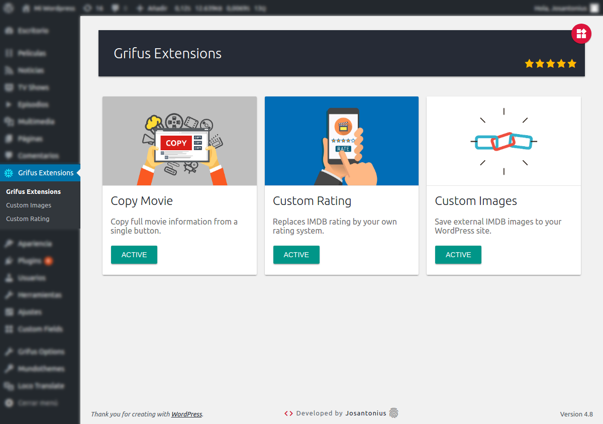
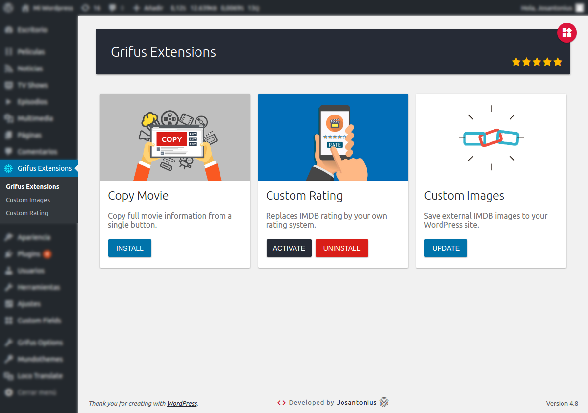

# Extensions For Grifus Wordpress Plugin

        

[Versión en español](README-ES.md)

Extensions for the Grifus theme.

---

- [Requirements](#requirements)
- [Installation](#installation)
- [Images](#images)
- [Tests](#tests)
- [TODO](#-todo)
- [Contribute](#contribute)
- [License](#license)
- [Copyright](#copyright)

---

This plugin contains three modules:

[Copy Movie Grifus](https://github.com/eliasis-framework/copy-movie-grifus.git)
Add a new button in the film pages of the Grifus theme with which you can copy the complete information with a single click.

[Custom Images Grifus](https://github.com/eliasis-framework/custom-images-grifus.git)
Save external IMDB images to your WordPress site. Replaces IMDB rating by your own rating system in Grifus theme.

[Custom Rating Grifus](https://github.com/eliasis-framework/custom-rating-grifus.git)
Replaces IMDB rating by your own rating system in Grifus theme. Replaces the static rating system of the Grifus theme by a dynamic rating system.

  

## Requirements

This WordPress plugin is supported by **PHP versions 5.6** or higher and is compatible with **HHVM versions 3.0** or higher.

The plugin has been developed under version 4.8 of WordPress and under version 4.0.3 of the Grifus theme.

## Installation

You can download this plugin from the [official repository](https://es.wordpress.org/plugins/extensions-for-grifus/) in WordPress.

From [Composer](http://getcomposer.org/download/). In the root folder of WordPress run:

    $ composer require josantonius/extensions-for-grifus

The previous command will only install the necessary files, if you prefer to **download the entire source code** you can use:

    $ composer require josantonius/extensions-for-grifus --prefer-source

From your WordPress dashboard:

	1. Visit 'Plugins > Add New'
	2. Search for 'Extensions For Grifus'
	3. Activate Extensions For Grifus from your Plugins page.

From WordPress.org:

	1. Download [Extensions For Grifus](https://es.wordpress.org/plugins/extensions-for-grifus/).
	2. Upload the 'extensions-for-grifus' directory to your '/wp-content/plugins/' directory, using your favorite method (ftp, sftp, scp, etc...).
	3. Activate Extensions For Grifus from your Plugins page.

Once Activated:
	
	1. Go to Grifus Extensions and install and activate the modules.
	2. Go to Grifus Extensions > Custom Rating and click the button to reset all ratings.
	3. Go to Grifus Extensions > Custom Images and click the button to replace all images.

## Images

## Tests 

To run [tests](tests) you just need [composer](http://getcomposer.org/download/) and to execute the following:

    $ git clone https://github.com/josantonius/extensions-for-grifus.git
    
    $ cd extensions-for-grifus

    $ bash bin/install-wp-tests.sh wordpress_test root '' localhost latest

    $ composer install

Run unit tests with [PHPUnit](https://phpunit.de/):

    $ composer phpunit

Run [WordPress](https://github.com/WordPress-Coding-Standards/WordPress-Coding-Standards/) code standard tests with [PHPCS](https://github.com/squizlabs/PHP_CodeSniffer):

    $ composer phpcs

Run [PHP Mess Detector](https://phpmd.org/) tests to detect inconsistencies in code style:

    $ composer phpmd

Run all previous tests:

    $ composer tests

## ☑ TODO

- [ ] Add more tests.
- [ ] Add new feature.
- [ ] Improve documentation.
- [ ] Refactor code for disabled code style rules. See [phpmd.xml](phpmd.xml) and [.php_cs.dist](.php_cs.dist).

## Contribute

If you would like to help, please take a look at the list of
[issues](https://github.com/josantonius/extensions-for-grifus/issues) or the [To Do](#-todo) checklist.

**Pull requests**

* [Fork and clone](https://help.github.com/articles/fork-a-repo).
* Run the command `composer install` to install the dependencies.
  This will also install the [dev dependencies](https://getcomposer.org/doc/03-cli.md#install).
* Run the command `composer fix` to excute code standard fixers.
* Run the [tests](#tests).
* Create a **branch**, **commit**, **push** and send me a
  [pull request](https://help.github.com/articles/using-pull-requests).

## License

This project is licensed under **GPL-2.0+ license**. See the [LICENSE](LICENSE) file for more info.

## Copyright

2017 - 2018 Josantonius, [josantonius.com](https://josantonius.com/)

If you find it useful, let me know :wink:

You can contact me on [Twitter](https://twitter.com/Josantonius) or through my [email](mailto:hello@josantonius.com).